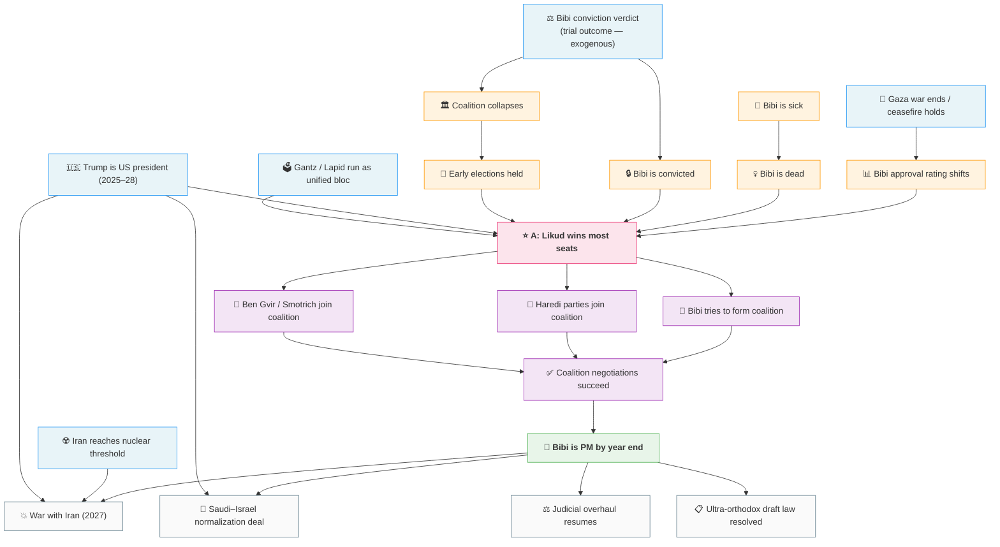

# BayesOracle — Design Plan

## Context

TruthMachine currently predicts P(A) for each event via credibility-weighted aggregation of news signals. BayesOracle is the next generation: it models the **causal and probabilistic relationships between events**, using the law of total probability to produce a better-calibrated final forecast. Eventually BayesOracle replaces the base TM forecast entirely (hard cutover once validated). **Optimize for accuracy, not simplicity.**

---

## Core Idea

```
P(A) = P(A|B)·P(B) + P(A|¬B)·P(¬B)
```

Where:
- **P(B)** = best available estimate for parent event B
- **P(A|B), P(A|¬B)** = conditional forecasts for A given B's outcome
- The final **BayesOracle forecast** blends the DAG-derived P(A) with TM's direct article-based signal

---

## Event Graph

### Structure
- **Directed Acyclic Graph (DAG)** — relationships are directional (B → A means A depends on B)
- **Topological ordering**: propagate bottom-up (roots first, leaves last)
- Within each DAG level, children update **in parallel**
- Cycles are a config error; detected at load time

### Storage
- **Storage-agnostic**: abstract behind a `BayesStore` interface (read/write edges, P(A|B) cache, ρ values)
- Start with JSON files; swap to SQLite or Postgres without changing calling code
- Edge data lives close to event metadata; cached conditional estimates in a separate store

### Graph authoring
- **Manual + LLM-suggested**: user defines edges; LLM can scan `data/events/` and propose parent–child candidates for review
- Edges validated: `outcome_date(B) < outcome_date(A)` enforced
- Independence pruning: if `P(A|B) ≈ P(A|¬B) ≈ P(A)` empirically, flag edge as uninformative — but require human review before removal (why was it added?)

---

## P(B) Source Hierarchy

For each parent event B, in priority order:

1. **Polymarket price** — if B has a PM market (`data/polymarket/{b}.json`), use current price (crowd-calibrated)
2. **TM base forecast for B** — credibility-weighted aggregation; sparse signal is acceptable
3. **Resolved outcome** — if B is already closed, use `outcome ∈ {0, 1}`

Future: compare PM and TM estimates; flag divergence as a signal of uncertainty.

---

## P(A|B) Estimation

### LLM call
The LLM receives:
- All articles already fetched about A (raw evidence)
- TM's current base forecast for A: `p2 = X`
- TM's current forecast for B: `P(B) = Y`

Prompt: *"Given these articles and the forecasts, if event B happens, what is P(A|B)? If B does not happen, what is P(A|¬B)?"*

### Conditionality routing
- Predictions with high `conditionality` score in the extractor that reference B → routed into **P(A|B) estimation input**, not treated as unconditional P(A) evidence
- Avoids double-counting; uses the existing `conditionality` field in `PredictionExtraction`

### Caching
- P(A|B) and P(A|¬B) cached in `BayesStore`
- Invalidated when new articles about B arrive (content hash / timestamp)

---

## What Conditioning Changes

When P(B) changes (new article arrives), A's forecast can update along three dimensions:

| Dimension | What changes | Flag |
|---|---|---|
| **Chances** | P(A) magnitude shifts | — |
| **Precision** | CI narrows or widens (P(B)'s certainty flows through to A's CI) | — |
| **Stance** | P(A) crosses 0.5 (direction flips) | `stance_flip: true` + push alert |

---

## p1 / p2 Fusion

Two independent estimates for P(A):
- **p1** = DAG bottom-up: `P(A) = Σ P(A|combo) · P(combo)` over all parent combinations
- **p2** = TM direct: credibility-weighted aggregation of articles about A

**Final forecast**: `P(A)_final = α · p1 + (1-α) · p2`

Where `α = f(parent_certainty, article_count_for_A, article_recency_for_A)` — a learnable parameter, calibrated against resolved events.

### Information overlap discount
When A and B share many articles (same conflict):
- `overlap = |articles_A ∩ articles_B| / |articles_A ∪ articles_B|` (Jaccard)
- Discount applied to the Bayesian update to avoid double-counting

---

## Correlated Parents

When A has multiple parents B1, B2:
- Model joint distribution P(B1, B2) with correlation ρ(B1, B2)
- ρ estimated by LLM once at graph-build time; stored in `BayesStore`
- Use **Gaussian copula** (or 2×2 contingency table) to derive all joint probabilities from marginals + ρ
- Full expansion: `P(A) = Σ over {B1,¬B1}×{B2,¬B2}: P(A|combo)·P(combo)`

---

## Temporal Ordering

- DAG validates `outcome_date(B) < outcome_date(A)`
- Deadline effect: if B's `outcome_date` passes without resolution, P(B) trends toward 0
  - Model: `P(B_eff) = P(B) · σ(days_remaining / halflife)`

---

## Reactive Propagation

- New article ingested for event B → pipeline immediately walks the DAG downward
- All children of B updated in parallel (within their topological level)
- Next level waits for current level to complete before updating its children
- Hooks into the existing pipeline ingest step in `pipeline/src/tm/`

---

## Alerts

- **Stance flip**: push notification (via `PushNotification` tool) + `stance_flip: true` in API response + pipeline log entry

---

## Oracle API Changes

`POST /forecast` gains:
- Optional `bayesian: bool` flag (default `true` once validated)
- Response includes both `base_forecast` and `bayes_forecast` during transition
- After hard cutover: `bayes_forecast` becomes the only `forecast` field

---

## CI Propagation

- Method TBD (defer to implementation)
- Candidates: Monte Carlo sampling (most accurate), delta method (analytic approximation)
- `chain_depth` metadata field on each forecast — longer chains signal wider inherent uncertainty

---

## Validation & Migration

1. Run base + Bayes in parallel on all new forecasts
2. Validate on the 13 resolved duel events (compare Brier scores)
3. Extend duel report to show TM-base vs TM-Bayes vs PM (three-way)
4. **Hard cutover** once TM-Bayes Brier beats TM-base consistently
5. BayesOracle becomes the sole production forecast

---

## Visualization

- **Full DAG view**: all events as nodes, edges, live P(A) and P(B) values per node
- **Per-leaf drilldown**: click any leaf → full Bayesian decomposition (p1, p2, α, P(B) per parent, P(A|B), CI, stance-flip flag, chain_depth)
- Separate page: `bayes_graph.html`

---

## Key Files to Create / Modify

| File | Change |
|---|---|
| `pipeline/src/tm/models.py` | Add `depends_on` to event schema; add `BayesEdge`, `BayesForecast` models |
| `pipeline/src/tm/bayes_store.py` | New: storage-agnostic interface for DAG edges + P(A|B) cache |
| `pipeline/src/tm/bayes_oracle.py` | New: core BayesOracle logic (LToTP, p1/p2 fusion, Jaccard discount, Gaussian copula) |
| `api/src/forecast_api/forecaster.py` | Integrate BayesOracle after base forecast; return both outputs |
| `api/src/forecast_api/models.py` | Extend `ForecastResponse` with `bayes_forecast`, `stance_flip`, `chain_depth` |
| `pipeline/src/tm/ingest.py` (or equivalent) | Trigger DAG propagation on new article ingestion |
| `bayes_graph.html` | New: DAG visualization with per-leaf drilldown |
| `data/events/*.json` | Add `depends_on` edges (starting with Middle East seed pairs) |

---

## Seed Events (Middle East)

First DAG edges to define manually once schema is ready:
- TBD — user will define; or LLM scans `data/events/` and proposes candidates for approval

---

## Example Graph — Israeli Politics DAG



### Correlation pairs to model (ρ)
| B1 | B2 | Expected ρ | Reason |
|---|---|---|---|
| Convicted | Coalition collapses | +0.7 | Conviction verdict is a likely trigger |
| Bibi sick | Bibi dead | +0.6 | Health chain |
| Gaza ends | Bibi approval | +0.5 | War outcome drives polling |
| Gantz unified | Likud wins | −0.6 | Strong opponent reduces Likud vote share |
| Iran nuclear | War with Iran | +0.8 | Threshold is primary trigger |
| Trump president | War with Iran | +0.5 | US green-light required |

